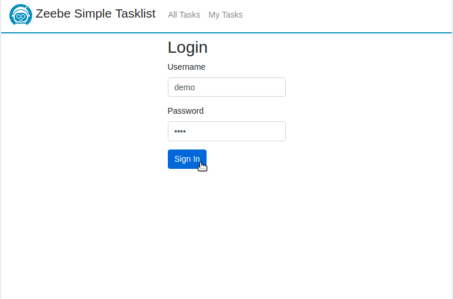

Zeebe Simple Tasklist
=========================

A [Zeebe](https://zeebe.io) worker to manage manual/user tasks in a workflow. It shows all jobs of type `user` as a task/todo-list. A user can complete the tasks with requested data. 

## Usage

Example BPMN with service task:
             
 ```xml
 <bpmn:serviceTask id="userTask" name="User Task">
   <bpmn:extensionElements>
     <zeebe:taskDefinition type="user" />
     <zeebe:taskHeaders>
       <zeebe:header key="name" value="My User Task" />
       <zeebe:header key="description" value="My first user task with a form field." />
       <zeebe:header key="formFields" value="[{\"key\":\"orderId\", \"label\":\"Order Id\", \"type\":\"string\"}]" />
       <zeebe:header key="assignee" value="demo" />
     </zeebe:taskHeaders>
   </bpmn:extensionElements>
 </bpmn:serviceTask>
 ```  

* the worker is registered for jobs of type `user`
* optional custom headers:
  * `name` - the name of the task _(default: the element id)_
  * `description` - a description what is the task about
  * `taskForm` (HTML) - the form to show and provide the task data ([example task form](https://github.com/zeebe-io/zeebe-simple-tasklist/blob/master/src/test/resources/custom-task-form.html))
  * `formFields` (JSON) - the form fields for the default task form, if no task form is set
  * `assignee` - the name of the user which should be assigned to the task
  * `candidateGroup` - the name of the group which can claim the task
* optional variables:
  * `assignee` - the name of the user which should be assigned to the task, if not set as header
  * `candidateGroup` - the name of the group which can claim the task, if not set as header
  
### Default Task Form

If no `taskForm` is defined then the default task form is used. It takes the `formFields` and renders a form with all defined fields. The fields are defined as JSON list, for example:

```
[{
    \"key\":\"orderId\", 
    \"label\":\"Order Id\", 
    \"type\":\"string\"
  }, {
    \"key\":\"price\", 
    \"label\":\"Price\", 
    \"type\":\"number\"
  }
]`)
```

The `type` must be one of: string, number, boolean.

## Install

1. Download the [JAR file](https://github.com/zeebe-io/zeebe-simple-tasklist/releases).

2. Execute the JAR file via

	`java -jar target/zeebe-simple-tasklist-{VERSION}.jar`

3. Go to http://localhost:8081

4. Login with `demo/demo`

### Configuration

The configuration can be changes via `application.properties`, `application.yaml` or command line arguments.

```
# Connection to Zeebe broker
io.zeebe.tasklist.connectionString=localhost:26500

# Path to the default task form  
io.zeebe.tasklist.defaultTaskForm=/templates/default-task-form.html

# Admin user
io.zeebe.tasklist.adminUsername=demo
io.zeebe.tasklist.adminPassword=demo

# Database settings
spring.datasource.url=jdbc:h2:~/zeebe-tasklist
spring.datasource.user=sa
spring.datasource.password=

# Connection to Hazelcast
io.zeebe.tasklist.hazelcast.connection=localhost:5701
io.zeebe.tasklist.hazelcast.topic=zeebe-JOB

# Server settings
server.port = 8081
```

## Build from Source

Build with Maven

`mvn clean install`

## Code of Conduct

This project adheres to the Contributor Covenant [Code of
Conduct](/CODE_OF_CONDUCT.md). By participating, you are expected to uphold
this code. Please report unacceptable behavior to code-of-conduct@zeebe.io.

## License

[Apache License, Version 2.0](/LICENSE) 

## About


