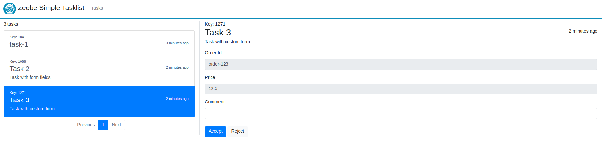

Zeebe Simple Tasklist
=========================

A [Zeebe](https://zeebe.io) worker to manage manual/user tasks in a workflow. It shows all jobs of type `user` as a task/todo-list. A user can complete the tasks with requested data. 

> This application can be used in development or as a blueprint for your own task-list. It is not designed to be used in production. 

## Usage

* the worker is registered for jobs of type `user`
* optional custom headers:
  * `name` (String) - the name of the task _(default: the element id)_
  * `description` (String) - a description what is the task about
  * `taskForm` (HTML) - the form to show and provide the task data ([example task form](https://github.com/zeebe-io/zeebe-simple-tasklist/blob/master/src/test/resources/custom-task-form.html))
  * `formFields` (JSON) - the form fields for the default task form, if no task form is set

**Default Task Form**

If no `taskForm` is defined then the default task form is used. It takes the `formFields` and renders a form with all defined fields. The fields are defined as JSON list, for example:

```
[{
    \"key\":\"orderId\", 
    \"label\":\"Order Id\", 
    \"type\":\"string\"
  }, {
    \"key\":\"price\", 
    \"label\":\"Price\", 
    \"type\":\"number\"
  }
]`)
```

The `type` must be one of: string, number, boolean.

**Example Service Task**

```xml
<bpmn:serviceTask id="userTask" name="User Task">
  <bpmn:extensionElements>
    <zeebe:taskDefinition type="user" />
    <zeebe:taskHeaders>
      <zeebe:header key="name" value="My User Task" />
      <zeebe:header key="description" value="My first user task with a form field." />
      <zeebe:header key="formFields" value="[{\"key\":\"orderId\", \"label\":\"Order Id\", \"type\":\"string\"}]" />
    </zeebe:taskHeaders>
  </bpmn:extensionElements>
</bpmn:serviceTask>
```

## How to run

Download the JAR file from the [download page](https://github.com/zeebe-io/zeebe-simple-tasklist/releases).

Or build it with Maven

`mvn clean install`

Execute the JAR file via

`java -jar target/zeebe-simple-tasklist-{VERSION}.jar`

## How to configure

The configuration can be changes via `application.properties`, `application.yaml` or command line arguments.

```
# Connection to Zeebe broker
io.zeebe.tasklist.connectionString=localhost:26500

# Path to the default task form  
io.zeebe.tasklist.defaultTaskForm=/my-default-task-form.html

# Database settings
spring.datasource.url=jdbc:h2:~/zeebe-tasklist
spring.datasource.user=sa
spring.datasource.password=

spring.jpa.hibernate.ddl-auto=update

# Server settings
server.port = 8081
```

## Screenshots

**Default Task Form**


**Custom Task Form**



## Code of Conduct

This project adheres to the Contributor Covenant [Code of
Conduct](/CODE_OF_CONDUCT.md). By participating, you are expected to uphold
this code. Please report unacceptable behavior to code-of-conduct@zeebe.io.

## License

[Apache License, Version 2.0](/LICENSE) 

[broker-core]: https://github.com/zeebe-io/zeebe/tree/master/broker-core
[agpl]: https://github.com/zeebe-io/zeebe/blob/master/GNU-AGPL-3.0
